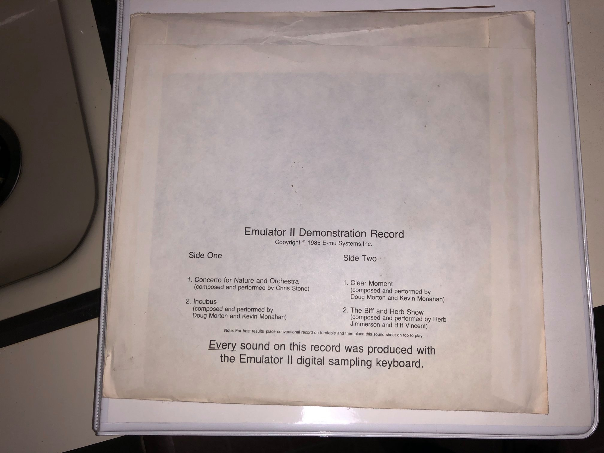

# EmulatorIIDemos
E-mu EmulatorII Demo Record

The original E-Mu Demo Record with performances by Kevin Monahan, Doug Douglas Morton, Herb Jimmerson, Biff Vincent and Chris Stone. Circa 1985. A creative way to demo a large part of the Emulator II sound library existing at that point. Kevin Monahan recorded most of the samples using a Sony F1 Digital Audio Recorder onto Betamax Video Tape. Dana Massie had designed (and we wirewrapped) an S-100 interface card for the Sony F1 recorder. That was plugged into a 68010 Microprocessor Based Unix computer, running BSD Unix. My Friend Victor Nowik was working in Berkeley at the time, and was able to help us get an early BSD Unix machine to program with. Dana Massie, Donna Murray, Alan Goldwater,Terry Schultz, and Dave Rossum all had our Z-80 development boards(with floppies!) linked to an 8 port serial interface on the Unix "mainframe" to program and upload/download programs and sample files.  The microcode for the Emulator II was a C-Language (mostly CPP macros) program, that when compiled and executed, generated the microcode for the Emulator II sound engine, and Dynamic RAM (DRAM) dual access and refresh controller. It arbitrated the access to the large sample memory between the main Z-80 microprocessor on the Emulator II, sampling input, eight channels of output and DRAM refresh. I was pretty proud of the microcode for the EII.
Another use of the UNIX "mainframe" was programming the microcode PROMS, and the EEPROMS for the Drumulators and all our other projects, and I developed the drivers and the programs to handle the DATAIO 29 programmer and all it's different programming attachments.

Cover Photo by Reek Havoc

